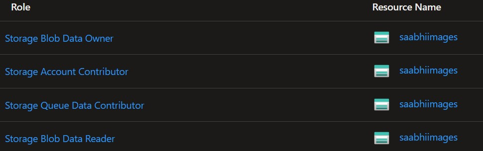

# Valet key pattern - Managed Identity between Azure Functions and Azure Storage

## Valet Key pattern
Use a token that provides clients with restricted direct access to a specific resource, in order to offload data transfer from the application.


## Implementation using Azure function 
The Azure function sample returns a SAS Url for a given blob(file) in Azure Storage by using Managed Identity. The code uses `UserDelegationKey` to generate the SAS token (required when using Managed Identity).


The permission and connectivity to the target storage account is controlled by the Identity and RBAC assignments in the associated Active Directory. The function makes the following calls behind the scenes to get the token & then uses the token to generate the SAS token for the blob in the Storage Account.


The managed identity used in this scenario is System Assigned Managed Identity which is enabled on the Azure Function.


Clicking the Azure role assignments button will show its assignment and permissions to the storage account that are to be granted.



### Run this on Azure
* Create a function App on Azure
* Enable system assigned managed identity
* Create a Storage Account & create a container in it
* Assign roles to the managed identity on the storage account as per the documentation below
    * [Permissions required to the identity](https://learn.microsoft.com/en-us/azure/azure-functions/functions-reference?tabs=blob#grant-permission-to-the-identity)
* Deploy the code to the function app on Azure

Get the function URL & then, add a new URL parameter `blobUri` that is the full http URL to your target blob. It will look something like this:

`https://<basename from deployment>.blob.core.windows.net/sample/<filename you uploaded>`

```bash
# sample curl request
curl "https://fn-valet-key.azurewebsites.net/api/getsasurl?code=xxxxxxx&blobUri=https://saabhiimages.blob.core.windows.net/images/betta-fish.png"

# sample response
https://fn_____.blob.core.windows.net/sample/my.file?skoid=......pxLSpVwuML%2B3UXrxBmC6XGA%3D
```

## Reference architecture & implementation


Refer [github repo](https://github.com/hugogirard/valetKeyPattern) for complete implementation.

## References
* [Using Managed Identity between Azure Functions and Azure Storage](https://learn.microsoft.com/en-us/samples/azure-samples/functions-storage-managed-identity/using-managed-identity-between-azure-functions-and-azure-storage/)
* [Permissions required to the identity](https://learn.microsoft.com/en-us/azure/azure-functions/functions-reference?tabs=blob#grant-permission-to-the-identity)
* `UserDelegationKey` required when using Managed Identity to generate the SAS token. The token can be generated without the UserDelegationKey if not using Managed Identity.
    * Refer [Get User Delegation Key](https://learn.microsoft.com/en-us/rest/api/storageservices/get-user-delegation-key)